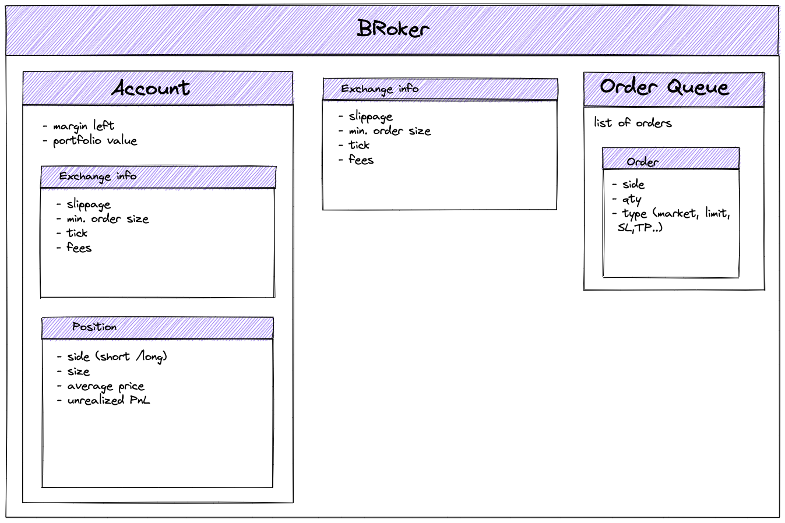
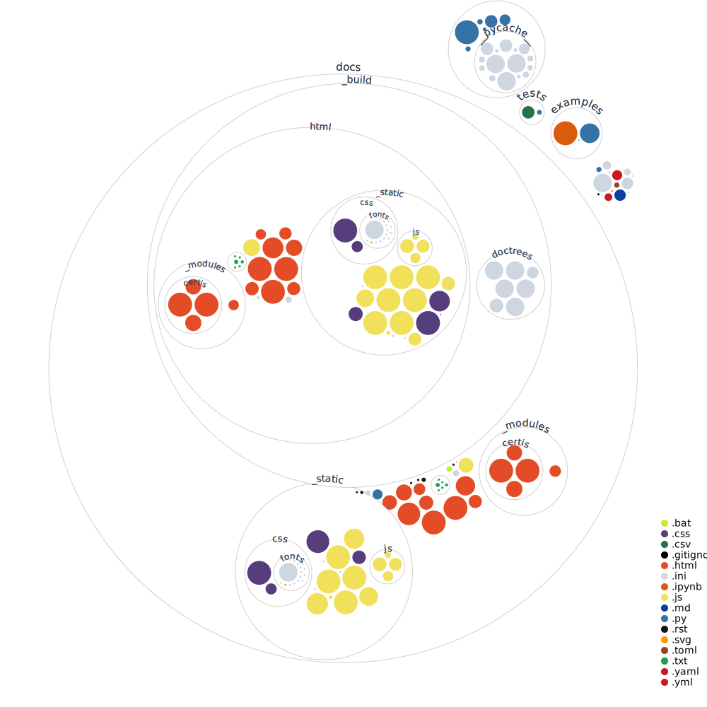

# Certis - Backtesting For all

Original Certis project was characterized by the following features:
- Certis is a powerful, lightweight, simple backtesting engine
- Certis is specialized in Backtesting Algorithm which trades Crypto / Crypto Futures, Perpetual Swaps

I use it for educational purposes to learn:
- how to structurize and model execution layer of a trading system
- what are the data structures can be modelled in a trading system

# Installation

To tinker with the engine, you can clone this repo and install editable package by running:
```sh
pip install -e ."
```
from the project root.

# Documentation of original Certis
Start by reading a docs of certis or look into examples folder.
- [Docs Link](https://certis.readthedocs.io/en/latest/)
- [Quickstart](https://github.com/Yeachan-Heo/Certis/blob/main/examples/Quickstart.ipynb)
> **NOTE:** Quickstart notebook requires installation of additional packages
> `pip install jupyter matplotlib yfinance`

# Generating documentation
You need sphinx to generate documentation. Check out how to install on your system:
```sh
# on debian-like systems (Debian, Ubuntu, etc.)
$ apt-get install python3-sphinx

# on macos
$ brew install sphinx-doc
# add it to your path - add the following line to your ~/.bash_profile
export PATH="/usr/local/opt/sphinx-doc/bin:$PATH"
```

## Features
- order types: `market`, `limit`, `stop market`, `stop loss market`, `take profit market`
- exchange characterization with: maker_fee, taker_fee, slippage, tick_size, minimum_order_size


## Missing
- optimization
- order sizing
- metrics calculation
- multiple positions in one account

## Consider to fix
- there is exchange info present both directly under broser as well as in the account object that is part of the broker.

## Architecture overview

### Simplified architecture graph of Certis

Simplified architecture of Certis

### Classes overview

Abstract classes:
 - **Action** (for order, order cancellation)
 - **Strategy** (with methods: calculate(), execute())
 - **Logger** (keep track of: transactions, account info and unfilled orders - mainly for backtesing purposes - to allow for analysis of the strategy)

main class for backtesing simulation
- **Engine** (run(), broker, logger, strategy, dataframe as dict of lists of indicators) )

main class for modeling the exchange and the account:
- **Broker** (account, exchange info, order queue)
- **ExchangeInfo** (exchange specification: tick_size, minimum_order_size, maker_fee, taker_fee,...)
- **Position** (size, side, avg_price, unrealized_PnL) - positions are stored in Account object
- **Account** (current margin left, portfolio value, position, market_info) - account is stored in broker

order -related classes:
- **OrderSide** (short, long)
- **OrderType** (market, limit, stop_market, SL_market, TP_market,...)
- **Order**(Action) (side, quantity, type) - there is queue of orders in Broker object
- **OrderCancellation**(Action)

Exemplary strategy as class:
- **MACrossing**(certis.Strategy)

There are classes exposed directly from Ceris package: "Strategy", "Order", "OrderType", "OrderSide", "Action" (why these?)

## Codebase Visualization
## Codebase Visualization


## Credits
This is a fork of [Certis](https://certis.readthedocs.io/en/latest/) written originally by [Yeachan-Heo](https://github.com/Yeachan-Heo)
